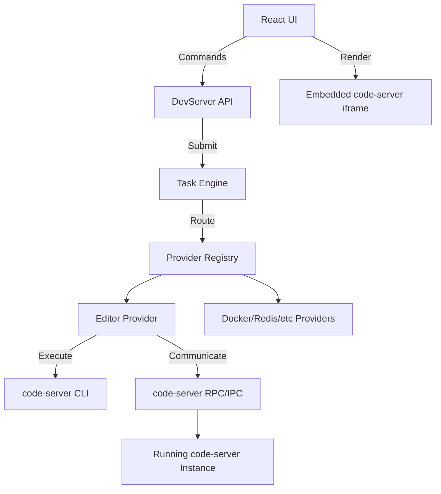

# DevServer: Code-Server Integration Design

## 1. Executive Summary
DevServer is evolving from a dashboard into an AI-powered development operating system. Building a custom editor from scratch introduces immense engineering overhead (syntax highlighting, intellisense, extensions) that distracts from our core value proposition: integrated intelligence, automation, and infrastructure management. 

Instead, DevServer will integrate `code-server` (VS Code in the browser) as a seamlessly managed **Provider** subsystem. This approach brings a mature editor engine while ensuring DevServer remains the central control plane. The user will experience a unified application where the editor operates as one module surrounded by AI, Task Execution, Knowledge Graph, and Infrastructure Management.

## 2. Overall Architecture



### The Editor Provider Contract
The editor is abstracted behind `internal/providers/editor/editor.go` to ensure DevServer remains editor-agnostic.

```go
type EditorProvider interface {
    Open(ctx context.Context, workspaceID, path string, line, column int) error
    Reveal(ctx context.Context, workspaceID, path string) error
    Save(ctx context.Context, workspaceID, path string) error
    Close(ctx context.Context, workspaceID, path string) error
    ActiveDocument(ctx context.Context, workspaceID string) (*Document, error)
    ExecuteCommand(ctx context.Context, workspaceID, command string, args map[string]any) error
}
```

## 3. Data Flow & Communication
**Strict Rule:** The frontend never communicates directly with `code-server`.
1. **Frontend Action**: User clicks "Jump to Definition" in Knowledge Explorer.
2. **Command Bus**: Frontend sends `POST /api/commands { "capability": "editor.open", "target": "internal/tasks/task.go", "args": {"line": 42} }`.
3. **Task Engine**: Enqueues and routes to `EditorRunner`.
4. **Editor Provider**: The backend provider communicates with the running `code-server` instance.
5. **Code-Server Execution**: The provider instructs `code-server` to open the file at the specific line.
6. **Event Bus**: The provider publishes an event (`editor.opened`) back to the Event Bus.
7. **Frontend Update**: UI updates state via WebSocket to reflect the new active document.

## 4. Multi-Workspace & Isolation Strategy
- **Isolation**: Each DevServer workspace will run its own dedicated instance of `code-server` on a dynamic local port. 
- **Configuration**: DevServer injects a customized `settings.json` and `keybindings.json` for each workspace to enforce platform themes, telemetry disabling, and integration defaults.
- **Data Directories**: Each workspace will have an isolated `--user-data-dir` and `--extensions-dir` housed within `.devserver/editor/`.

## 5. Authentication & Security Model
- **Network Boundaries**: `code-server` binds to `127.0.0.1` and is never exposed directly to the network.
- **Proxying**: DevServer acts as a reverse proxy (`/proxy/editor/{workspaceId}/*`), wrapping `code-server` in DevServer's authentication layer.
- **Iframe Sandboxing**: The frontend embeds `code-server` via an `<iframe>` pointing to the proxy route, utilizing `sandbox="allow-scripts allow-same-origin allow-forms allow-modals"`. Cross-origin restrictions are handled by DevServer proxy headers.

## 6. Extension Management & Persistence
- **Curated Baseline**: DevServer provisions a baseline of extensions (e.g., Git, language servers) required for the operating surface.
- **Persistence**: Extensions are installed locally inside `.devserver/editor/extensions`.
- **Management UI**: Users manage extensions through the DevServer Provider UI, which triggers backend tasks (`editor.extension.install`) that invoke `code-server --install-extension <name>`.

## 7. Customization & Theming
To ensure DevServer feels like one integrated product (and not a website containing an iframe):
- **Theme Sync**: DevServer overrides the VS Code theme to match the overarching platform aesthetics perfectly.
- **Minimal UI**: `code-server` will be launched with flags to hide its native Activity Bar, Status Bar, and Sidebar. DevServer provides the unified Sidebar, Explorer, and Inspector.
- **IPC Bridge**: A custom VS Code extension (built natively for DevServer) acts as an IPC bridge, passing internal VS Code events (e.g., active text editor changed, file dirtied) back to the DevServer backend.

## 8. Migration Plan
1. **Phase 1 (Preparation)**: Merge this design doc. Create the `EditorProvider` interface and stub `tasks.EditorRunner`.
2. **Phase 2 (Lifecycle Management)**: Implement backend orchestration to spawn/terminate `code-server` instances dynamically based on Workspace state.
3. **Phase 3 (Proxy & Integration)**: Set up the HTTP/WebSocket reverse proxy in DevServer. 
4. **Phase 4 (UI Replacement)**: Replace the current `WorkspaceEditor` (textarea MVP) with an `<iframe>` targeting the proxy.
5. **Phase 5 (Event Bridging)**: Develop the DevServer VS Code Extension to bridge `executeCommand`, file state, and cursor tracking.
6. **Phase 6 (Cleanup)**: Deprecate MVP editor components and merge `code-server` deeply into the Explorer & Knowledge workflows.
