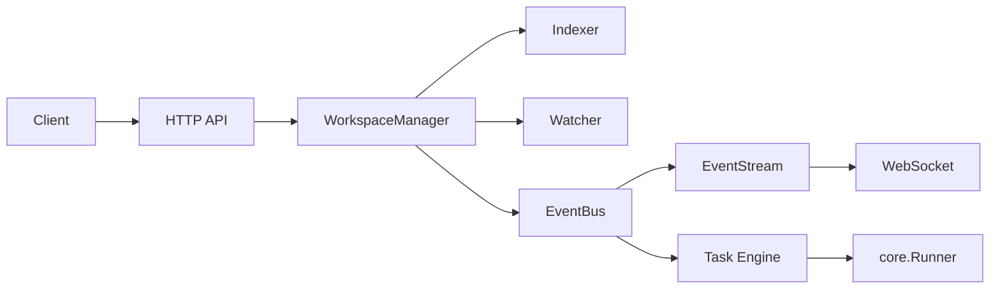

# Runtime Diagram

```mermaid
flowchart LR
  Client --> API[HTTP API]
  API --> Manager[WorkspaceManager]
  Manager --> Indexer[Indexer]
  Manager --> Watcher[Watcher]
  Manager --> Bus[EventBus]
  Bus --> Stream[EventStream]
  Stream --> WS[WebSocket]
  Bus --> Tasks[Task Engine]
  Tasks --> Runner[core.Runner]
```
