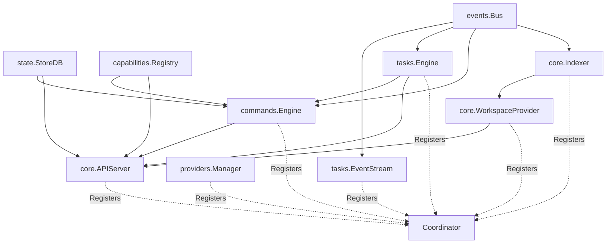
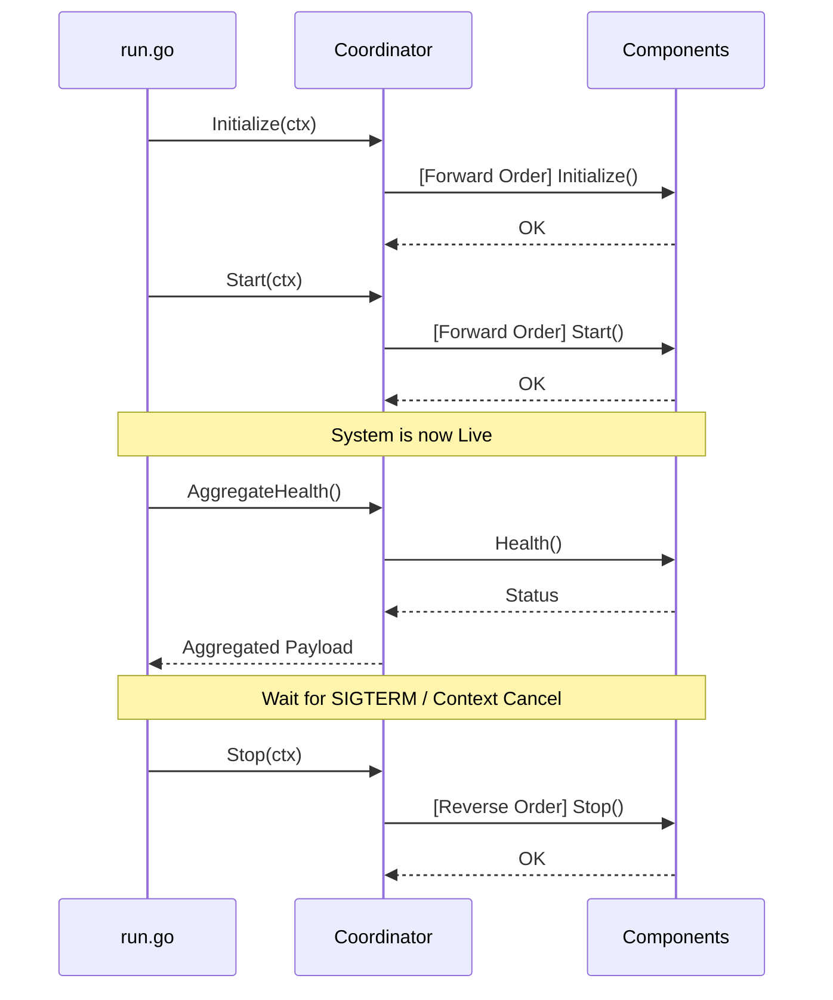

# Runtime Baseline Report (Phase 2)

## 1. Components Registered
The following core subsystems have been successfully adapted to the `runtime.Component` interface and are registered in the DevServer Runtime:

1. `tasks.EventStream` (WebSocket Broadcast)
2. `providers.Manager` (Infrastructure Orchestration)
3. `core.WorkspaceProvider` (Workspace State & Context)
4. `core.Indexer` (File & Symbol Knowledge)
5. `tasks.Engine` (Background Execution & Queuing)
6. `commands.Engine` (Intent Routing & Dispatch)
7. `core.APIServer` (HTTP Ingress & REST Handlers)

## 2. Startup Order
The Coordinator strictly follows the registration order for initialization and startup. This ensures fundamental systems (like the Event Stream) are ready before higher-level systems (like the API server) start serving traffic.

1. `tasks.EventStream` -> `Start()`
2. `providers.Manager` -> `Start()`
3. `core.WorkspaceProvider` -> `Start()`
4. `core.Indexer` -> `Start()`
5. `tasks.Engine` -> `Start()`
6. `commands.Engine` -> `Start()`
7. `core.APIServer` -> `Start()`

*(Note: If any component fails during `Start()`, the Coordinator rolls back and stops all previously started components immediately).*

## 3. Shutdown Order
Shutdown is executed in **reverse** registration order to ensure systems stop accepting work before their underlying dependencies are torn down.

1. `core.APIServer` -> `Stop()` (Stops HTTP traffic)
2. `commands.Engine` -> `Stop()` (Stops accepting commands)
3. `tasks.Engine` -> `Stop()` (Drains and stops workers)
4. `core.Indexer` -> `Stop()` (Halts file parsing)
5. `core.WorkspaceProvider` -> `Stop()` (Drops caches)
6. `providers.Manager` -> `Stop()` (Cleans up infrastructure state)
7. `tasks.EventStream` -> `Stop()` (Disconnects WebSockets)

## 4. Aggregated Health
The Coordinator exposes a unified health check mechanism (`coordinator.AggregateHealth()`), replacing scattered health checks.

```json
{
  "status": "healthy",
  "components": {
    "tasks.EventStream": "healthy",
    "providers.Manager": "healthy",
    "core.WorkspaceProvider": "healthy",
    "core.Indexer": "healthy",
    "tasks.Engine": "healthy",
    "commands.Engine": "healthy",
    "core.APIServer": "healthy"
  }
}
```

## 5. Dependency Graph
Dependencies are injected manually in `cmd/devserver/run.go` prior to registration, ensuring the Runtime Coordinator operates strictly as a lifecycle manager, not a Service Locator.



## 6. Lifecycle Sequence (Normal Execution)


