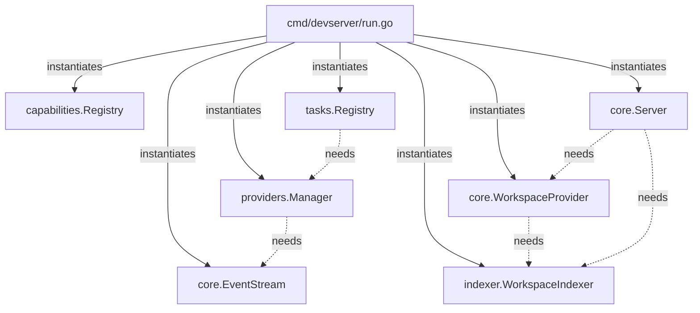
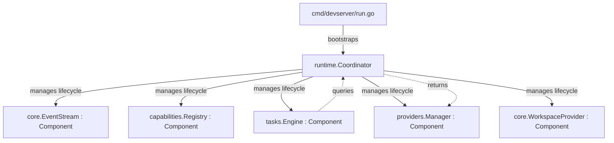

# Runtime Migration: Dependency Graph

## 1. Current State (Fragmented Hard-Wiring)

Currently, subsystems are instantiated and wired manually in `cmd/devserver/run.go`. Subsystems cannot dynamically discover one another, and initialization order is hardcoded.

## 2. Target State (Runtime Coordinator)

By introducing the `internal/runtime` package, the `Runtime` becomes a thin coordinator. It does not wrap existing systems; instead, existing systems (like `tasks.Engine`) adapt to implement the `Component` interface.

### Key Differences
1. **No Wrapper Layers**: `TaskEngine` implements `Component`. We do not create a redundant `TaskRuntime` layer.
2. **Standardized Lifecycle**: The `Runtime` orchestrates `Initialize()`, `Start()`, `Health()`, and `Stop()` across all registered Components safely.
3. **Event Envelope**: `EventBus` utilizes standard envelopes (`ID`, `Type`, `Source`, `Time`, `Payload`) instead of generic maps.
