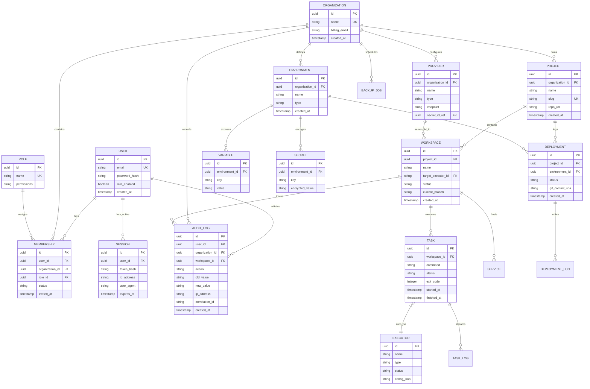

# Entity Relationship Model — DevServer Platform

> **WP**: WP-8.6.17 Phase A — Design Only  
> **Status**: Draft — Pending Review  
> **Updated**: 2026-07-07

---

## 1. Unified Entity Relationship Diagram (ERD)

The following Mermaid diagram maps the database entity constraints, primary-to-foreign keys, and relational cardinality across the platform stack.

---

## 2. Cardinality Definitions

* **User to Membership**: One-to-Many (`1:N`). A user can belong to multiple organizations, and each membership relates to a single organization.
* **Organization to Environments**: One-to-Many (`1:N`). An organization owns multiple environment contexts (Dev, Staging, Prod), which are isolated.
* **Project to Workspaces**: One-to-Many (`1:N`). A project acts as a code grouping; developers spawn individual isolated workspaces to edit and test that project.
* **Workspace to Tasks**: One-to-Many (`1:N`). Tasks (builds, tests, index loops) run inside a workspace context and map to an infrastructure **Executor**.
* **Environment to Variables & Secrets**: One-to-Many (`1:N`). Environments isolate plain-text configurations (Variables) and cipher references (Secrets).
* **Audit Log to User / Org / Workspace**: Many-to-One (`N:1`). Audit logs capture actions driven by users within organizations, tracking workspace identifiers where applicable.

---

> [!IMPORTANT]
> This document must be approved before any WP-8.6.17 UI implementation begins, as mandated by Permanent Developer Rule 15.
