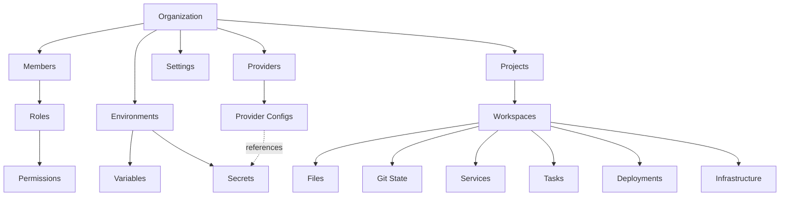

# Information Architecture — DevServer Platform

> **WP**: WP-8.6.17 Phase A — Design Only  
> **Status**: Draft — Pending Review  
> **Updated**: 2026-07-07

---

## 1. Navigation Hierarchy

```
DevServer Platform
├── Overview (L1)
│   ├── Dashboard                    /dashboard
│   ├── Workspace Explorer           /workspace/[id]
│   ├── Projects                     /projects
│   └── Settings Hub                 /settings
│
├── Operations (L1)
│   ├── Deployments                  /workspace/[id]#deployments
│   ├── Servers                      /workspace/[id]#infrastructure
│   ├── Domains                      /workspace/[id]#domains
│   ├── SSL                          (embedded in Domains)
│   └── Services                     /workspace/[id]#services
│
├── Platform (L1)
│   ├── Databases                    /workspace/[id]#database
│   ├── Storage                      (future)
│   ├── Terminal                     (future)
│   ├── Monitoring                   /monitor (placeholder)
│   ├── Logs                         /workspace/[id]#logs
│   └── Users                        /settings#members
│
├── Configuration (L1)
│   ├── AI Providers                 /config/providers
│   ├── Environments                 /config/environments
│   └── Secrets                      (embedded in Environments)
│
├── DevCenter (L1)
│   ├── Architecture                 /devcenter/architecture
│   ├── Tasks                        /devcenter/tasks
│   ├── Knowledge                    /devcenter/knowledge
│   ├── Dependencies                 /devcenter/dependencies
│   ├── API                          /devcenter/api
│   ├── Database                     /devcenter/database
│   └── Project Doctor               /devcenter/project-doctor
│
└── Admin (L1)
    └── Settings                     /settings
```

---

## 2. Grouping Rationale

| Group | Rationale | Target Audience |
|---|---|---|
| **Overview** | Entry points and high-level observability | All roles |
| **Operations** | Day-to-day runtime management actions | Operators, Admins |
| **Platform** | Infrastructure-level resources and data stores | Operators, Admins |
| **Configuration** | Provider and environment configuration | Admins, Owners |
| **DevCenter** | Developer-facing documentation and diagnostics | Developers |
| **Admin** | Governance and organizational settings | Owners, Admins |

---

## 3. Page Responsibilities

| Page | Primary Responsibility | Data Ownership | Mutation Authority |
|---|---|---|---|
| `/dashboard` | System-wide health, metrics, activity feed | Read-only aggregation | None |
| `/workspace/[id]` | Development environment (code, tasks, AI) | Workspace-scoped | Developer+ |
| `/projects` | Project listing and CRUD | Organization-scoped | Developer+ |
| `/settings` | Org management, members, preferences | Organization-scoped | Admin+ |
| `/config/providers` | AI provider CRUD and testing | Organization-scoped | Admin+ |
| `/config/environments` | Environment + Variable + Secret CRUD | Organization-scoped | Admin+ |
| `/login` | Session initialization | User-scoped | Anonymous |
| `/setup` | Platform bootstrap | System-scoped | Root only |
| `/devcenter/*` | Reference documentation and diagnostics | Read-only | None |

---

## 4. Relationships



### Entity Dependency Chain

```
Organization
  └─ Membership (User + Role)
  └─ Environment
       └─ Variable
       └─ Secret (AES-256 encrypted)
  └─ ProviderConfig
       └─ SecretRef → Environment.Secret
  └─ Project
       └─ Workspace
            └─ IndexerCache
            └─ GitInfo
            └─ ProviderState[]
            └─ TaskEngine
```

---

## 5. Search Model

### 5.1 Global Search (Topbar)

| Searchable Entity | Fields Indexed | Result Format |
|---|---|---|
| Projects | `name`, `slug`, `description` | Card with link to `/projects/[slug]` |
| Workspace Files | `path`, `name` | File link to `/workspace/[id]?file=[path]` |
| Members | `email`, `username` | Row link to `/settings#members` |
| Providers | `name`, `type` | Card link to `/config/providers` |
| Environments | `name`, `type` | Row link to `/config/environments` |
| Knowledge Articles | `title`, `summary` | Card link to DevCenter |

### 5.2 Contextual Search (Per-Screen)

| Screen | Search Scope | Implementation |
|---|---|---|
| Workspace Files | File tree paths | Client-side filter on loaded tree |
| Members Table | Email, name, role | API query param `?search=` |
| Environment Variables | Key names | Client-side filter |
| Projects List | Name, slug | API query param `?search=` |
| Audit Logs (future) | Action, user, timestamp | API query params |

### 5.3 Search Architecture

```
User Input
  └─ Debounce (300ms)
      └─ Global: Parallel API calls to search endpoints
      └─ Contextual: Client-side filter OR single API call
          └─ Results rendered in dropdown/panel
              └─ Keyboard navigation (↑↓ Enter Esc)
```

---

## 6. Information Flow

```
Bootstrap → Login → Dashboard
                       │
              ┌────────┼────────┐
              ▼        ▼        ▼
          Projects  Settings  Config
              │        │        │
              ▼        │        ▼
          Workspace    │   Providers
              │        │   Environments
      ┌───┬───┼───┐    │
      ▼   ▼   ▼   ▼    ▼
    Files Tasks AI Git  Members
```

---

> [!IMPORTANT]
> This document must be approved before any WP-8.6.17 UI implementation begins.
