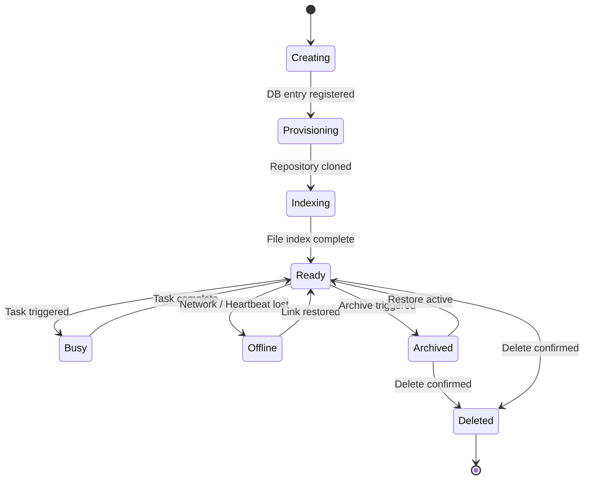
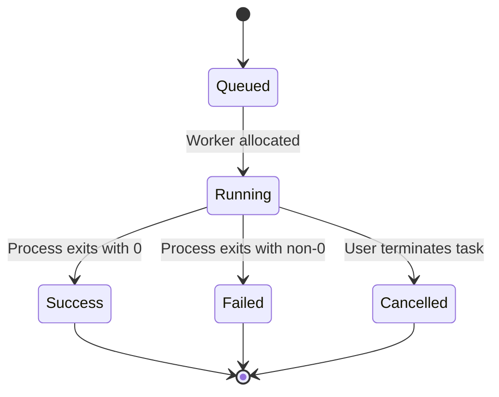
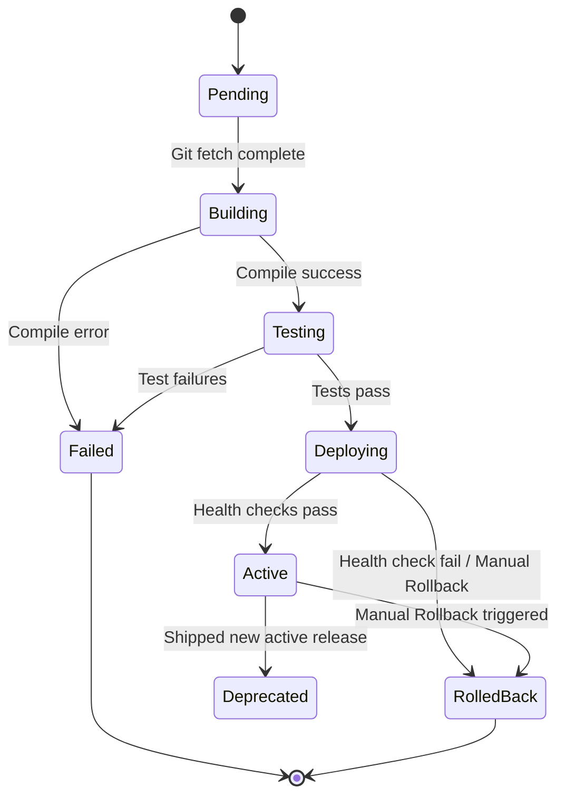
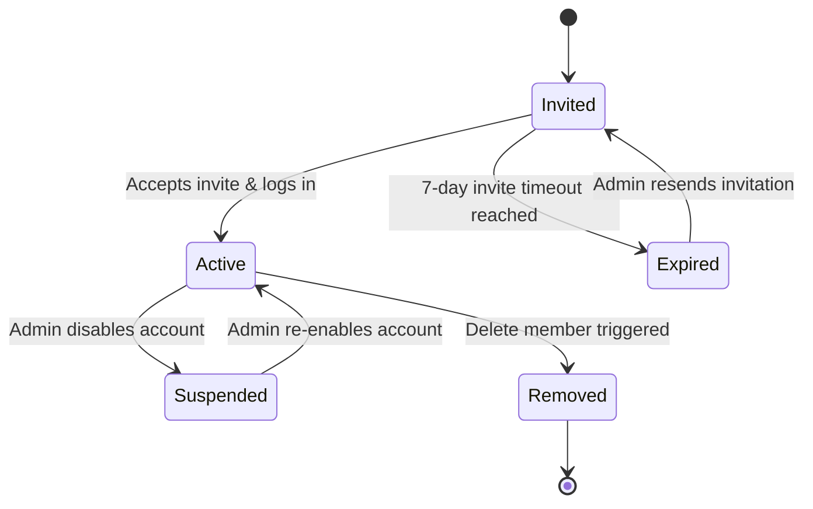
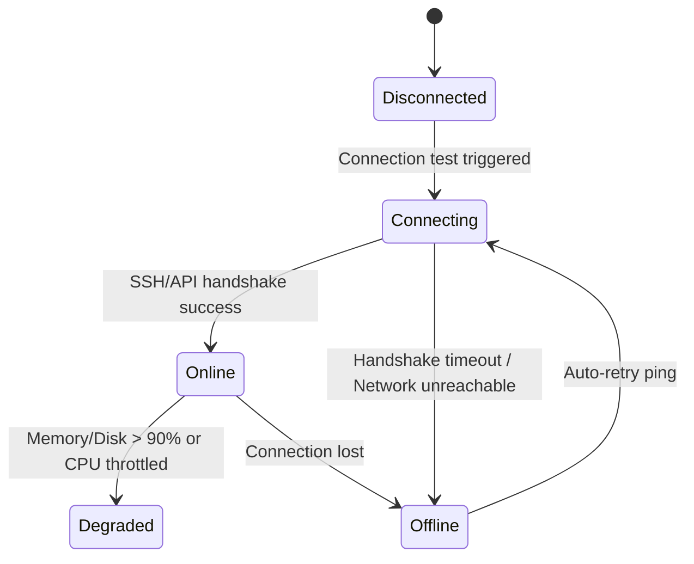

# State Transition Models — DevServer Platform

> **WP**: WP-8.6.17 Phase A — Design Only  
> **Status**: Draft — Pending Review  
> **Updated**: 2026-07-07

---

## 1. Workspace Lifecycle State Machine

A workspace manages its runtime state based on cloning operations, indexing tasks, and lifecycle actions.

### Transition Validation Rules

| Current State | Event | Next State | Triggering API Action | Permission |
|---|---|---|---|---|
| **Creating** | Clone repo success | **Provisioning** | Git clone finished | System |
| **Provisioning**| Index files start | **Indexing** | Indexer spawned | System |
| **Indexing** | Index finished | **Ready** | Index files complete | System |
| **Ready** | Run Task | **Busy** | `POST /api/tasks` | Developer+ |
| **Busy** | Task finished | **Ready** | Executor task end | System |
| **Ready** | Connection lost | **Offline** | Heartbeat failure (30s timeout) | System |
| **Offline** | Heartbeat received| **Ready** | Network link restored | System |
| **Ready** | Archive workspace | **Archived** | `POST /api/workspaces/archive` | Operator+ |
| **Archived** | Restore workspace | **Ready** | `POST /api/workspaces/unarchive`| Developer+ |
| **Ready** | Delete workspace | **Deleted** | `DELETE /api/workspaces` | Admin+ |

---

## 2. Task Engine State Machine

Tasks are managed by the execution runner queue and report real-time progress via WebSockets.

### Transition Validation Rules

| Current State | Event | Next State | Triggering Event |
|---|---|---|---|
| **Queued** | Executor slots clear | **Running** | Runner consumes queue item |
| **Running** | Task process finishes | **Success** | Exit code `0` returned |
| **Running** | Task process crashes | **Failed** | Exit code `> 0` returned |
| **Running** | Terminate clicked | **Cancelled** | SIGINT/SIGKILL sent to executor |

---

## 3. Deployment Pipeline State Machine

Deployments track release states targeted at specific environments.

---

## 4. Member Invitation State Machine

Governs team membership lifecycle states within an organization.

---

## 5. Infrastructure Executor State Machine

Represents connection states of remote docker, WSL, local, or SSH runner environments.

---

> [!IMPORTANT]
> This document must be approved before any WP-8.6.17 UI implementation begins, as mandated by Permanent Developer Rule 15.
