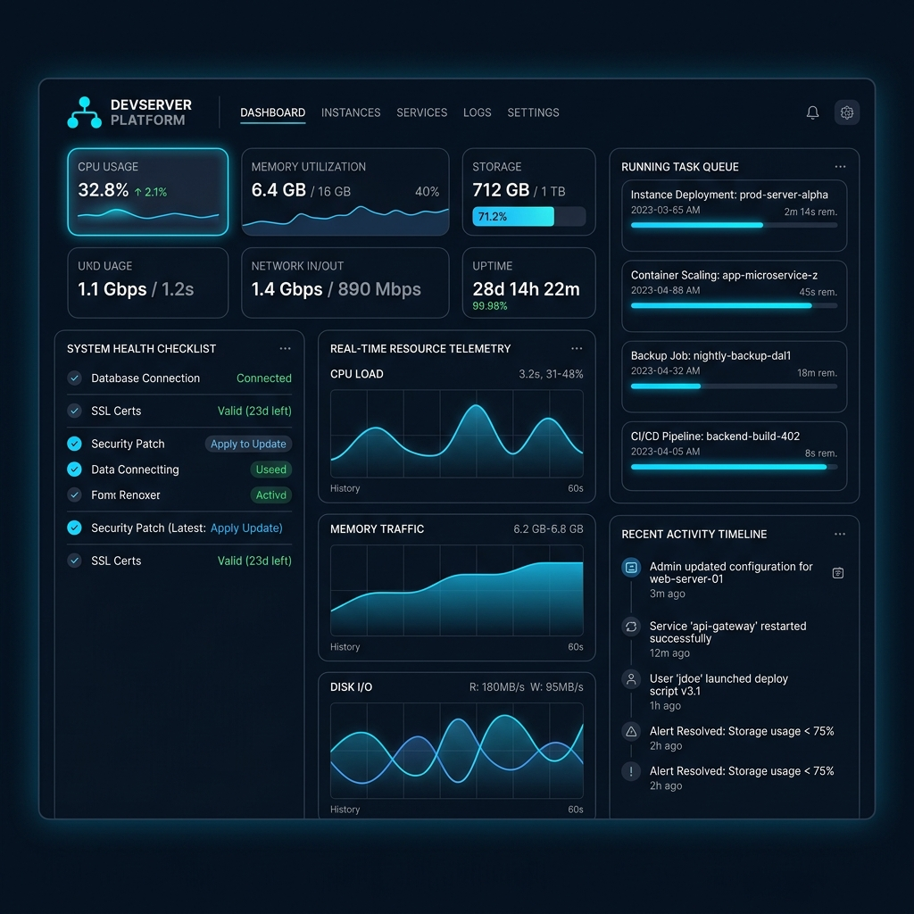
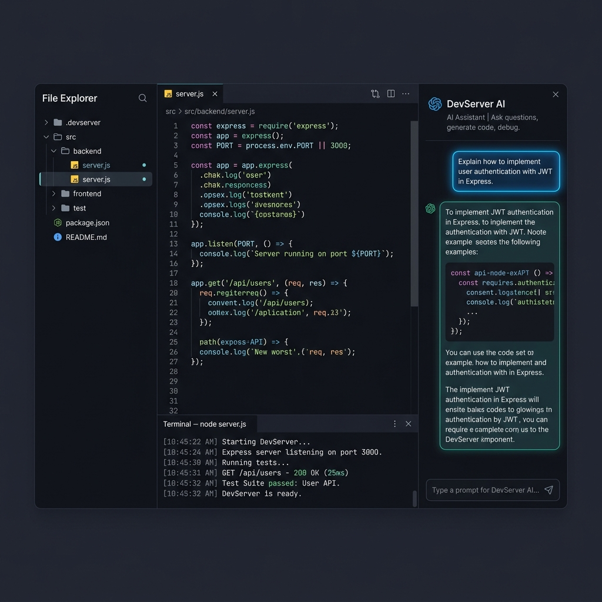
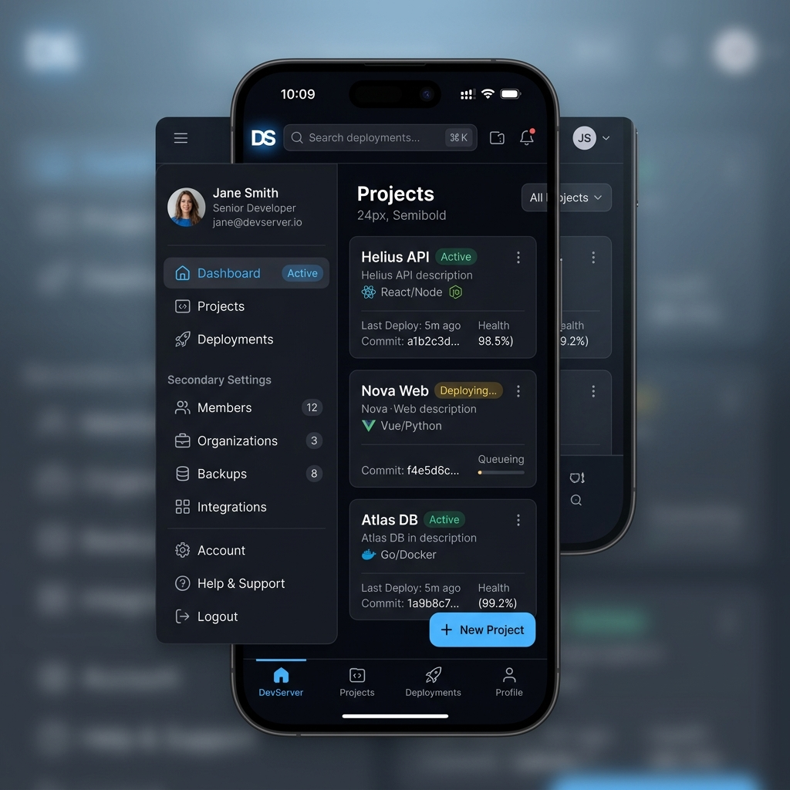

# Wireframes & High-Fidelity Mockups — DevServer Platform

> **WP**: WP-8.6.17 Phase A — Design Only  
> **Status**: Draft — Pending Review  
> **Updated**: 2026-07-07

---

## 1. High-Fidelity UI Design Mockups (Gap #17)

Before UI code implementation (Phase B) is authorized, developers must align components exactly with these high-fidelity visual targets.

### 1.1 Desktop Dashboard Interface Mockup
Visual target for the main 12-column telemetry dashboard grid, utilizing the customized modern dark HSL palette.


### 1.2 Tablet Split-Pane IDE Workspace Mockup
Visual target for the file browser, syntax-highlighted editor, bottom logs console, and right sidebar AI chat assistant.


### 1.3 Mobile Navigation Layout Mockup
Visual target for bottom navigation bars, hamburger drawers, and mobile list grid items.


---

## 2. Directory Structure

```
docs/design/WIREFRAMES/
├── README.md              (this file)
├── assets/
│   ├── desktop_dashboard_mockup.png
│   ├── tablet_workspace_mockup.png
│   └── mobile_navigation_mockup.png
├── DESKTOP/
│   ├── 01-bootstrap.md
│   ├── 02-login.md
│   ├── 03-setup-wizard.md
│   ├── 04-dashboard.md
│   ├── 05-settings.md
│   ├── 06-members.md
│   ├── 07-providers.md
│   ├── 08-environments.md
│   ├── 09-projects.md
│   ├── 10-workspace.md
│   └── 11-devcenter.md
├── TABLET/
│   └── ...
└── MOBILE/
    └── ...
```

---

## 3. Wireframe Specification Per Page

Each wireframe document must contain:
1. **Page Title & Route**
2. **ASCII Layout Diagram** (structural wireframe)
3. **Component Mapping** (which components from `COMPONENT_LIBRARY.md`)
4. **Responsive Notes** (what changes at each breakpoint)
5. **Interaction Notes** (hover, click, keyboard)
6. **Pixel Tolerance** (±2px from approved mockup)

---

## 4. Desktop Wireframe Layout Samples

### 01 — Bootstrap Loading (`/`)
```
┌─────────────────────────────────────────────────┐
│                                                 │
│           ┌───────────────────────┐             │
│           │  [Brand Mark]  D      │             │
│           │  DevServer             │             │
│           │                       │             │
│           │  Initializing...      │             │
│           │                       │             │
│           │  ████ ████ ████ ████  │             │
│           │  (pulse animation)    │             │
│           └───────────────────────┘             │
│                                                 │
└─────────────────────────────────────────────────┘
```
Components: `bootstrap-screen.tsx`, brand-lockup

### 02 — Login (`/login`)
```
┌─────────────────────────────────────────────────┐
│                                                 │
│           ┌───────────────────────┐             │
│           │  [Brand Mark]         │             │
│           │  Welcome Back         │             │
│           │                       │             │
│           │  ┌─────────────────┐  │             │
│           │  │ Email           │  │             │
│           │  └─────────────────┘  │             │
│           │  ┌─────────────────┐  │             │
│           │  │ Password        │  │             │
│           │  └─────────────────┘  │             │
│           │                       │             │
│           │  [    Sign In     ]   │             │
│           │                       │             │
│           │  ┌─ Knowledge ──────┐ │             │
│           │  │ Learn Card       │ │             │
│           │  │ Learn Card       │ │             │
│           │  └──────────────────┘ │             │
│           └───────────────────────┘             │
└─────────────────────────────────────────────────┘
```
Components: `Input`, `Button(primary)`, `LearnCard`

---

## 5. Viewport Adaptation Rules

* **Tablet Adaptations (721px–960px)**:
  - Sidebar collapses to top bar containing horizontal scroll tabs or hamburger icon.
  - Metric grids collapse from 4 columns to 2 columns.
  - Page grids collapse from 2 columns to 1 column.
  - Workspace: section tabs collapse into horizontal scrollable indicators.

* **Mobile Adaptations (≤720px)**:
  - L1 Sidebar is fully hidden. Primary items migrate to Bottom Tab Bar. Secondary items move to Left Hamburger Drawer.
  - Grid structures collapse to a single column.
  - Inner card padding drops to `16px` (`--space-7`).
  - Rows and tables transform into individual card lists to optimize thumb scrolling.

---

## 6. Pixel Tolerance Rule

> Every implemented screen must match the approved mockup within **±2px** tolerance unless a justified deviation is documented and approved.

---

> [!IMPORTANT]
> This wireframe set must be approved before any WP-8.6.17 UI implementation begins, as mandated by Permanent Developer Rule 15.
