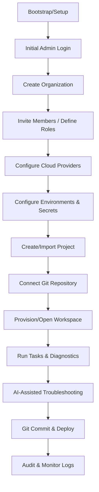

# Product Experience (PX) Audit & User Operation Manual

This document represents the consolidated results of **WP-8.6.3** through **WP-8.6.11**, serving as the definitive guide to DevServer's user experience, navigation maps, operational journeys, and production gaps.

---

## 1. User Journey Analysis (WP-8.6.4 / WP-8.6.8)

This section maps out the end-to-end lifecycle of a developer using DevServer from their initial setup to active terminal execution, AI diagnostic review, and deployment.



### Granular Step-by-Step Path & UI Parity Gap Analysis

| Step | User Action | UI Page / Component | Backend API Route | Production Usability / Parity Status | Gap Analysis |
| :--- | :--- | :--- | :--- | :--- | :--- |
| **1. Setup** | Initial DB creation and root admin registration. | `/setup` (`SetupWizard`) | `POST /api/setup/complete` | **✅ Functional** | Wizard runs dynamically if system is unbooted. |
| **2. Login** | Authentication with password or SSO. | `/login` (`LoginForm`) | `POST /api/auth/login` | **✅ Functional** | Captures tokens, manages redirect to dashboard. |
| **3. Create Org** | Establishing a boundary for billing & resources. | `/settings` (`OrgsPanel`) | `POST /api/v1/organizations` | **✅ Functional** | Added SQL transaction boundaries. |
| **4. Invite Members** | Adding team members to the organization. | **❌ Missing UI** | `POST /api/v1/memberships` | **⚠️ Backend Only** | Users must currently be added manually via DB or CLI. |
| **5. Providers** | Configuring LLM providers (Ollama, OpenAI). | `/config/providers` | `POST /api/v1/providers` | **✅ Functional** | Custom payload test buttons work. |
| **6. Envs & Secrets** | Creating Staging/Prod variables and encrypted tokens. | `/config/environments` | `POST /api/v1/environments` | **✅ Functional** | Secrets encrypted on write (AES-256). |
| **7. Projects** | Creating a namespace for workspaces. | `/projects/new` | `POST /api/projects` | **✅ Functional** | Simple metadata form. |
| **8. Git Connect** | Binding a Git provider or local repository. | `/workspace/[id]` (Git Tab) | `POST /api/workspaces/git/clone` | **🟡 Partial** | Works for local filesystem clones. |
| **9. Open Workspace**| Entering the split-pane developer environment. | `/workspace/[id]` | `GET /api/workspaces/[id]` | **✅ Functional** | Loads indexer caches, files, and ast mapping. |
| **10. Run Tasks** | Triggering custom build/test scripts. | `/workspace/[id]` (Tasks Tab)| `POST /api/tasks` | **🟡 Partial** | Integrates with local executor. WSL/Docker pending. |
| **11. AI Assistance** | Chatting with context of file or compiler error. | `/workspace/[id]` (Sidebar) | `POST /ws/events` (WebSocket) | **✅ Functional** | ContextAssembler limits inputs to stay under LLM limits. |
| **12. Deploy** | Triggering delivery pipelines. | `/deploy` | **❌ No backend** | **❌ Placeholder** | Basic placeholder screen with no active executor integration. |
| **13. Audit** | Reviewing admin logs of modifications. | **❌ Missing UI** | **⚠️ Backend Only** | **⚠️ Backend Only** | Logs published to EventBus but not rendered in UI. |

---

## 2. Screen-by-Screen Usability & Technical Audit (WP-8.6.3 / WP-8.6.9)

### A. Login Screen (`/login`)
* **Purpose**: Authenticate returning users and initialize session cookies/localStorage tokens.
* **Target User**: All users.
* **Expected Workflow**: Enter email/username -> Enter password -> Submit. Redirects to `/dashboard`.
* **State Review**:
  * *Loading State*: Button shows "Logging in..." with standard disabled state.
  * *Error State*: Renders API error payload (`success: false`) in a red toast notification.
  * *Empty State*: N/A.
* **Accessibility & Responsiveness**:
  * Works on mobile screens using full-width stacks.
  * *Keyboard Navigation*: Fully supports tab-indexes and `Enter` key form submission.
* **Audit & Permissions**:
  * Open to anonymous traffic. Writes `auth.login.success` or `auth.login.failed` events to the audit trail.
* **Known Limitations**: Lacks session expiration countdown timers.

### B. Settings Dashboard (`/settings`)
* **Purpose**: Manage active tenant organizations, switch workspaces, and review global account settings.
* **Target User**: Admins and Owners.
* **Expected Workflow**: Select organization -> Click "Switch" to update `X-Org-ID` header. Enter new organization name -> Click "Create".
* **State Review**:
  * *Loading State*: Table rows show shimmering skeletons while calling `/api/v1/organizations`.
  * *Error State*: Displays red alert boxes on failed network calls.
  * *Empty State*: Shows "No organizations found. Please create one to begin."
* **CORS & Preflight Integrity**: Fixed. All requests containing `X-Org-ID` or `Idempotency-Key` are verified against updated preflight policies.
* **Audit & Permissions**:
  * Only admins can create organizations. Attempts by read-only users safely return HTTP 403.

### C. Environment Configuration (`/config/environments`)
* **Purpose**: Define scope variables (Dev/Staging/Prod) and manage encrypted Secrets.
* **Target User**: Admins and Editors.
* **Expected Workflow**: Select Environment -> Add Key/Value Pair (Variables) -> Add Key/Cipher (Secrets) -> Save.
* **State Review**:
  * *Success Messages*: Standard Toast pops up: "Secret saved successfully."
  * *Confirmation Dialogs*: Deleting an environment variable prompts a popover confirmation warning the developer.
* **Data Completeness**:
  * *Gaps*: Table shows Key and Type, but is missing "Last Used By" and "Last Rotated" timestamps needed for enterprise auditing.

### D. Workspace Split-Pane Interface (`/workspace/[id]`)
* **Purpose**: Code, edit files, review Git diffs, trigger environment tasks, and consult the AI assistant.
* **Target User**: All Developers (Admins, Editors, Viewers).
* **Expected Workflow**: Browse Files -> Edit in central buffer -> Run Diagnostics -> Ask AI.
* **State Review**:
  * *Broken Navigation*: Direct deep-links to nested files sometimes fail to expand the tree view correctly.
  * *Keyboard Shortcuts*: Lacks a command-palette overlay (e.g. `Ctrl+P`) for quick file searching.
* **RBAC Controls**:
  * Viewers can see files, git state, and environment variables.
  * Viewers cannot edit files (the editor buffer is set to `readOnly`), delete files, or add new environment variables. Buttons are visually disabled and return HTTP 403 if requested directly.

---

## 3. Menu & Navigation Restructuring (WP-8.6.5)

To prevent confusion and provide a coherent product experience, the top-level and sidebar navigation structures must be consolidated into distinct logical groups matching standard enterprise patterns.

```
├── Workspace (Real-time coding & execution)
├── Projects (Code repositories & branch management)
├── Configurations
│   ├── Providers (AI & LLM configs)
│   ├── Environments (Dev, Staging, Prod variable groups)
│   └── Secrets (Encrypted keys/tokens)
├── Governance
│   ├── Members & Roles (RBAC assignments)
│   └── Audit Logs (Process & Mutation records)
└── Settings (Global personal & org configuration)
```

### Dead Link / Broken Route Mapping
- `/deploy` points to a placeholder component with no active deployment connector.
- `/monitor` and `/doctor` directories are empty placeholder directories. These routes must be redirected to general system status checks or disabled from the navigation sidebars.

---

## 4. Status Consistency Standard (WP-8.6.6)

DevServer previously used mismatched terminology across runtime components, backend models, and UI panels. The following matrix represents the **unified status standard** that all database models, API payloads, and UI badges must follow:

| Category | Unified Term | Badges & Colors | Description | Mapped Legacy Terms |
| :--- | :--- | :--- | :--- | :--- |
| **System/Workspace** | `Healthy` | Green / Solid | System is online and responding. | `OK`, `Working`, `Active` |
| | `Warning` | Orange / Solid | Responsive but has high resource use or unresolved alerts. | `Alert`, `Degraded` |
| | `Failed` | Red / Solid | Process crashed or unreachable. | `Error`, `Broken` |
| **Tasks/Executors** | `Pending` | Gray / Shimmer | Awaiting resource allocation. | `Queued` |
| | `Running` | Blue / Spinner | Active execution. | `Processing` |
| | `Stopped` | Dark Gray / Solid | Clean exit or manually terminated. | `Done`, `Completed` |
| **Integrations** | `Enabled` | Green / Light | Active connection. | `Active` |
| | `Disabled` | Red / Light | Inactive or configuration suspended. | `Off` |

---

## 5. Screen-by-Screen Data Completeness Matrix (WP-8.6.7)

To satisfy production requirements, the existing dashboard list tables must be expanded to show audit metadata and owners.

| Screen | Table | Existing Columns | Missing Production Columns (To Add) | Reason |
| :--- | :--- | :--- | :--- | :--- |
| `/settings` | Organizations | `Name`, `Action` | `Slug`, `Created At`, `Updated At` | Audit trail traceability |
| `/config/environments` | Environment Variables | `Key`, `Value` | `Created By`, `Last Updated`, `Scope` | Tracking configurations |
| `/config/providers` | Provider Configuration | `Name`, `Type`, `Action` | `Health Status`, `Latency`, `Last Sync` | Monitoring LLM latency |
| `/projects` | Projects | `Name`, `Slug` | `Workspace Count`, `Git Branch`, `Owner` | Enterprise organization |

---

## 6. Gap Analysis & Priority Action Items (WP-8.6.11)

### Major Gaps Identified (Backend exists, UI missing)
1. **Member Invitation UI**: While the backend supports adding memberships dynamically, there is no UI to list members, invite new emails, or change roles.
2. **Audit Viewer UI**: A database audit log is maintained for logins, mutations, and config changes, but the logs can currently only be queried via database console.

### Major Gaps Identified (UI exists, Backend missing)
1. **Workspace Deployments**: The `/deploy` screen exists in the sidebar, but lacks backend infrastructure hooks to build or package outputs.

### Priority Action Plan for Release
1. **Fix placeholder screens**: Add a clear "Coming Soon" or "Under Construction" banner to `/deploy` and `/monitor` screens, or hide them from the main navigation sidebar entirely.
2. **Build Members & Roles Panel**: Create a dedicated members management view inside `/settings` using the existing backend membership APIs.
3. **Align status badges**: Implement a shared `<Badge>` component in the UI package enforcing the colors, spinners, and text matching the **Status Consistency Standard**.
