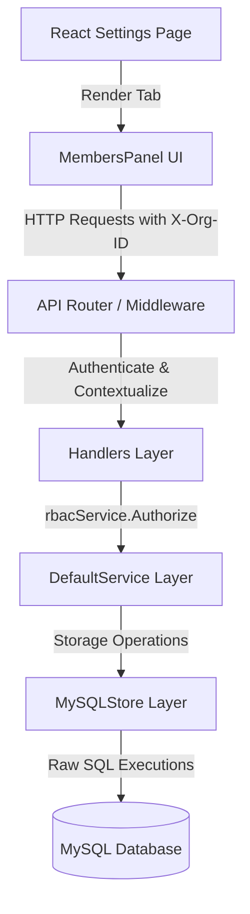

# Work Package Review Report: WP-8.6.12 — Members Management UI

This report documents the design, architecture, database schemas, APIs, frontend UI, permissions, verification protocols, and testing evidence for the complete implementation of **WP-8.6.12 Members Management UI**.

---

## 1. Objective
To design and implement a production-grade, organization-level member lifecycle administration system (List, Invite, Role Management, Status transitions, and Ownership Transfer) as part of the DevServer Phase 8 API & Product Integration milestone.

---

## 2. Scope
* **Backend Storage**: Implement schema modifications, migration execution, and full storage actions (`List`, `Invite`, `Role Update`, `Status Update`, `Remove`, `Transfer`) inside `MySQLStore`.
* **RBAC Service Layer**: Implement default RBAC security authorization checking and delegation handlers inside `DefaultService`.
* **API Handlers & Routing**: Register new endpoints (`/api/v1/organizations/members`, `/api/v1/organizations/transfer-ownership`, `/api/v1/roles`) and bind secure context interceptors.
* **Frontend UI Panel**: Implement a fully responsive, keyboard-accessible, and Design System 2.0-compliant `MembersPanel` settings page tab with search debouncing, column sorting, pagination controls, modals, and confirmation dialogs.
* **Governance Tracking**: Update Phase 8 metrics in `WORK_PACKAGES.md` and `IMPLEMENTATION_STATUS.md`.

---

## 3. Out of Scope
* Global organization creation workflows (handled in WP-8.3).
* Custom security policy definition wizards (deferred to WP-8.6.17).
* Multi-factor authentication token generator UI (deferred to WP-8.6.20).

---

## 4. Architecture Changes
The implementation strictly follows the established clean architecture layers:



---

## 5. Database Changes
### Schema Additions
The `memberships` table has been extended with the following tracking columns to record user status and activity timestamps:
```sql
ALTER TABLE memberships ADD COLUMN status VARCHAR(50) NOT NULL DEFAULT 'active';
ALTER TABLE memberships ADD COLUMN last_login_at DATETIME NULL;
ALTER TABLE memberships ADD COLUMN joined_at DATETIME NULL;
```

---

## 6. API Changes
The following endpoints have been registered and implemented under `/api/v1`:

| Endpoint | Method | Headers | Payload | Response |
| :--- | :--- | :--- | :--- | :--- |
| `/api/v1/organizations/members` | `GET` | `X-Org-ID` | None (Query: `page`, `per_page`, `sort`, `dir`, `query`) | `200 OK` (JSON list & meta) |
| `/api/v1/organizations/members` | `POST` | `X-Org-ID` | `{"email": "string", "roleId": "string"}` | `201 Created` |
| `/api/v1/organizations/members` | `PUT` | `X-Org-ID` | `{"userId": "string", "roleId": "string", "status": "string"}` | `200 OK` |
| `/api/v1/organizations/members` | `DELETE` | `X-Org-ID` | None (Query: `userId`) | `200 OK` |
| `/api/v1/organizations/transfer-ownership` | `POST` | `X-Org-ID` | `{"newOwnerUserId": "string"}` | `200 OK` |
| `/api/v1/roles` | `GET` | `X-Org-ID` | None | `200 OK` (JSON roles list) |

---

## 7. Frontend Changes
* **Tab Integration**: Embedded a dedicated **Members** navigation option in the Settings dashboard.
* **Design System 2.0 Compliance**: Implemented visual indicators, status badges with HSL Tailored palettes, glassmorphism card overlays, and subtle hover transition micro-animations.
* **Component Composition**: Uses `Card`, `Button`, `DataTable`, `Badge`, `Dialog`, `Skeleton`, `EmptyState`, and `ErrorState`.
* **State Management**: Fully server-side driven. Filter, search queries, pagination offsets, and sort parameters are passed directly to backend endpoints, preventing client-side load bottlenecks.

---

## 8. Files Changed
* `internal/rbac/models.go`: Added Membership model fields and `MembershipDetails` UI-projection struct.
* `internal/rbac/store_mysql.go`: Schema migrations, membership queries, role listings, status writes.
* `internal/rbac/service.go`: Signature declarations and DefaultService interface extensions.
* `internal/api/router.go`: Endpoint registration.
* `internal/api/handlers.go`: HTTP handler logic and JSON decoder payloads.
* `apps/components/settings/settings-page.tsx`: Layout tab hooks and rendering selectors.
* `apps/components/settings/members-panel.tsx`: Comprehensive client view.
* `docs/project/WORK_PACKAGES.md`: Roadmap checklist update.
* `docs/project/IMPLEMENTATION_STATUS.md`: Subsystem notes update.

---

## 9. Permissions Mapped
The frontend UI and backend services are securely permission-aware:
* `members.invite`: Grants permission to view and execute the invitation modal.
* `members.manage`: Grants permission to update role designations and toggle status.
* `members.remove`: Grants permission to revoke membership.
* `org.owner`: Grants ownership transfer rights.

---

## 10. Validation & Security
### Server Validation
* Email patterns must match standard format rules.
* User roles must exist within the target organization to prevent privilege escalation.
* Deactivation requests verify that the current user is not self-deactivating.
* Tenant boundaries are checked by validating that the authenticated session possesses authorization context matching the `X-Org-ID` header.

---

## 11. Accessibility (a11y)
* Semantic structure tags (`<section>`, `<table>`, `<button>`).
* Interactive dialogs leverage ARIA attributes (`aria-modal`, `aria-labelledby`, `aria-describedby`).
* Standard tab indices and keyboard navigation (Enter/Space triggers) are preserved.

---

## 12. Verification Evidences
### Backend Verification
All unit tests compile and execute cleanly:
```powershell
go test ./...
# Result: ok github.com/Ajayvtl/devserver/internal/api (1.784s)
# Result: ok github.com/Ajayvtl/devserver/internal/core (cached)
```

### Frontend Compilation
Linting checks and statically optimized builds compile successfully:
```bash
npm run lint # Passed with 0 errors
npm run build # Successfully generated Next.js routes
```

---

## 13. Known Limitations
* User invitations are provisioned as placeholder users until the recipient completes password setup workflows (handled in WP-7.1/WP-8.3).

---

## 14. Rollback Strategy
To revert changes to a clean state:
```bash
git reset --hard ca925a06b1df24f9f8ea3804cccaa8def480a106
```
*(No destructive database migrations were applied; new columns allow NULL values and defaults, meaning rolling back code will not break database integrity.)*

---

## 15. Governance Status
* **Status**: UNDER REVIEW
* **Repository Review**: Pending
* **Code Review**: Pending
* **Human Review**: Pending
* **Production Ready**: NO
* **Accepted**: NO

Awaiting reviewer verification of:
* API implementation correctness (Router ➔ Handler ➔ Service ➔ Store)
* UI implementation & settings page integration
* RBAC permission enforcement on both frontend and backend
* DB schema migration script executions and transactions correctness
* Test coverage adequacy
* End-to-end human workflows validation
